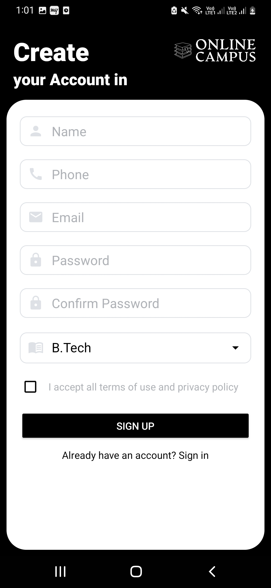
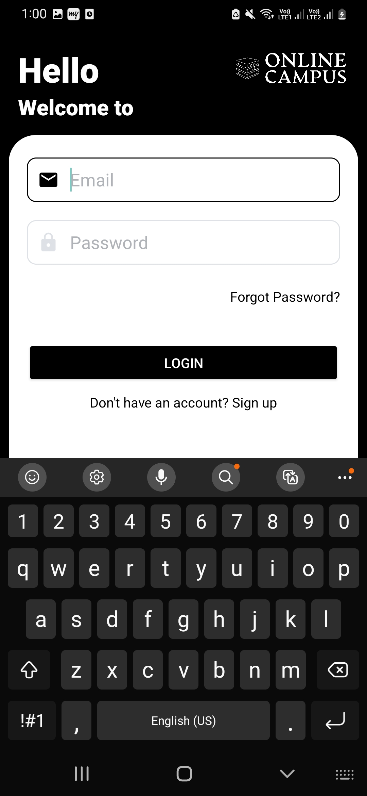
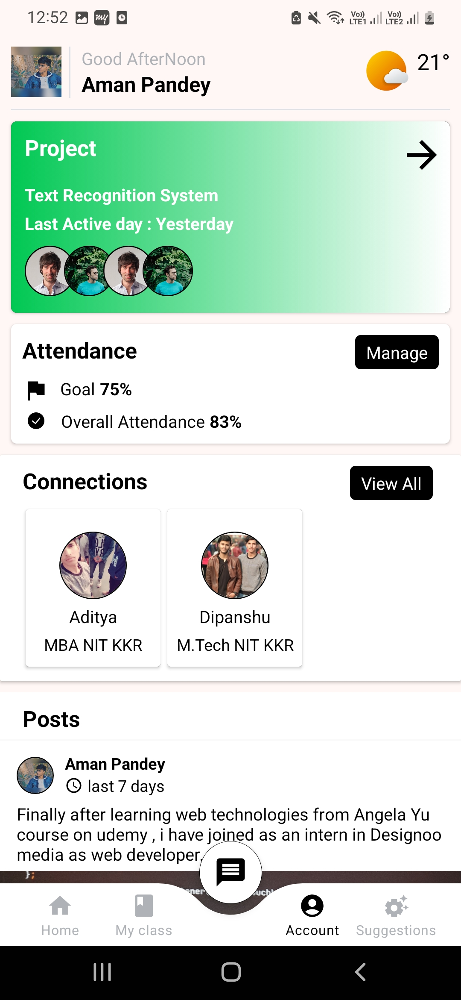
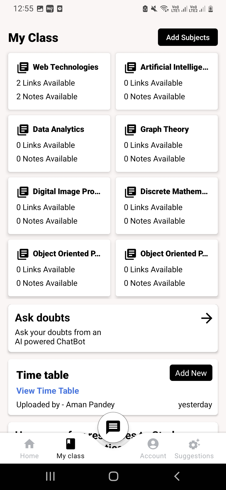
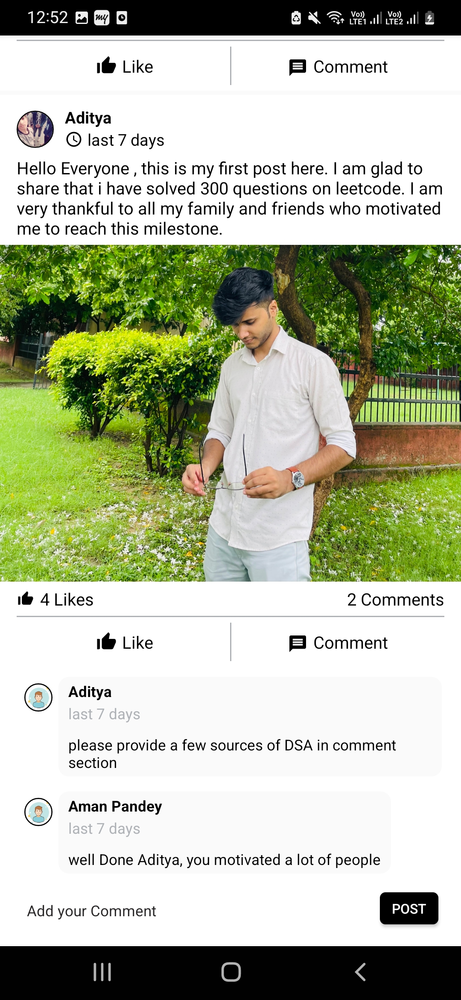
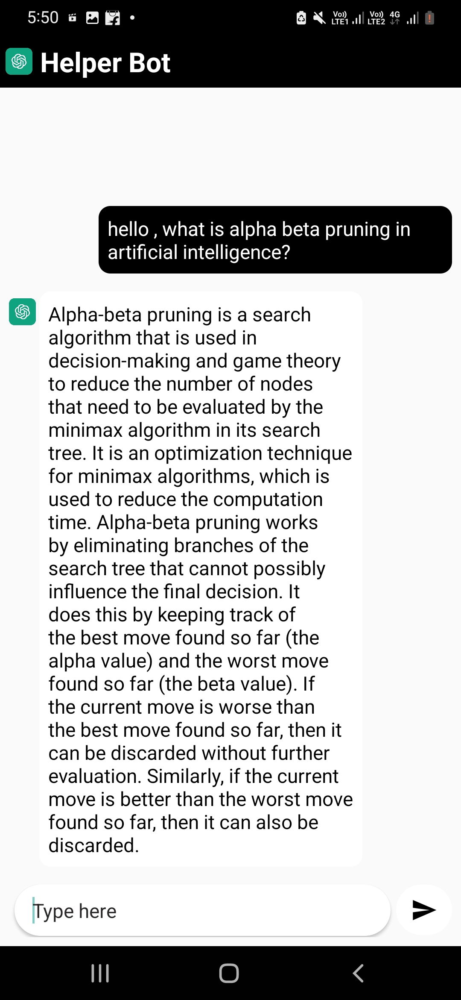
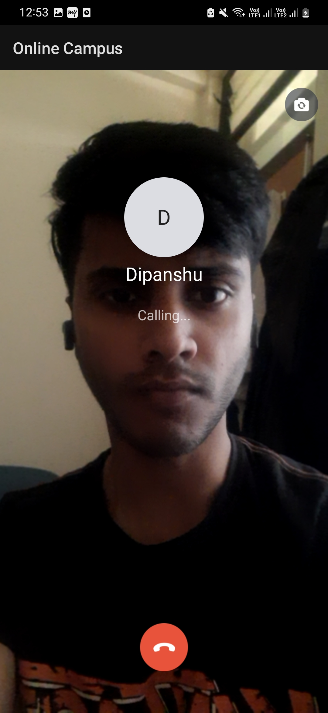
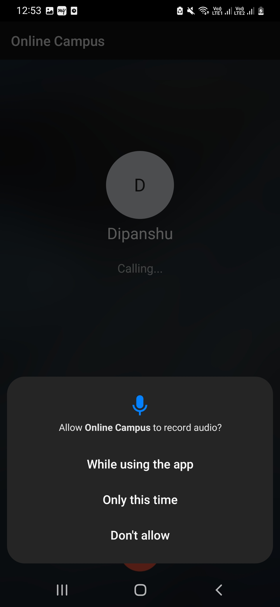
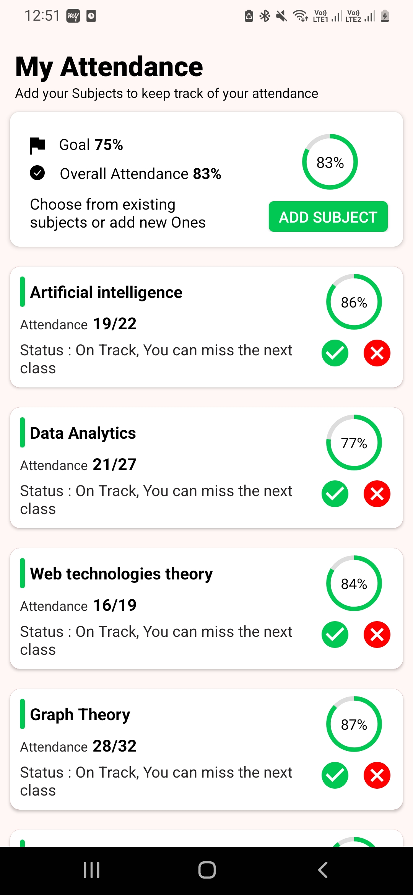
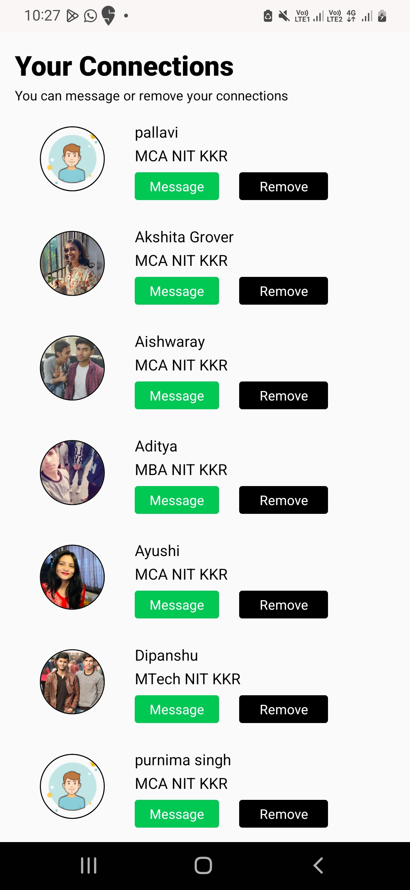

# OnlineCampus
This is an android application for college students to interact with each other, solve their quries and manage their social as well as academic life.
You will need three things for this application to work 
1. Chat GPT api key
2. Zegocoloud Account
3. FCM Server Key

Here are some screenshots of app

For further clarfications or doubts you can connect with me at amanpandey12398@gmail.com 
